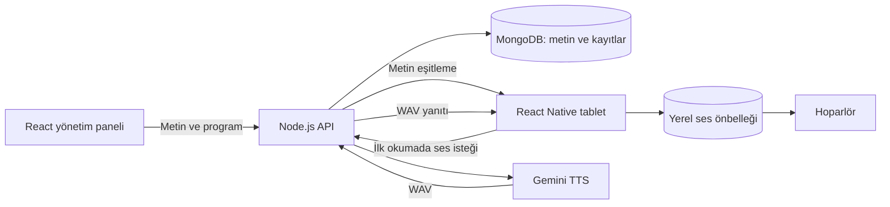

# Mimari ve çalışma kuralları

## Metin teslimi

Hatırlatıcı `content` içinde metin, ses tercihleri, program, sürüm ve ses anahtarı taşır. Kaydetme veya eşitleme sırasında ses üretilmez. Tablet 30 saniyede bir ve ön plana döndüğünde programı SQLite'a yazar. Heartbeat'teki `installed`, **metin sürümünün alındığını** ifade eder; sesin üretildiği veya dinlendiği anlamına gelmez.

Metin güncellemeleri ilk eşitlemede etkinleşir. Yeni metnin sesi üretilemiyorsa eski metnin sesi okunmaz. API eski `desired/active` kayıtlarını, en son istenen metni kullanarak yeni biçime dönüştürür; eski GridFS verilerini silmez veya kullanmaz. Eski tablet snapshot'ı ilk çevrimiçi eşitlemede değiştirilir.

## Okuma ve önbellek

Zamanlayıcı, zamanı gelen rutinin yerel ses dosyasını arar. Dosya yoksa kimlik doğrulamalı `POST /api/reminders/:id/speech` isteği gönderir. Sunucu ailenin metnini MongoDB'den alır ve Gemini'ye iletir. Yanıt WAV olarak tablete geçer; sunucuda ses saklanmaz. API anahtarı hiçbir istemciye gönderilmez.

Ses anahtarı aile, model, metin, ses ve tarzın SHA-256 özetidir. Saat/renk gibi değişiklikler dosyayı yeniden kullanabilir. Tablet WAV başlığını, boyutunu ve yanıt anahtarını doğrular; geçici dosyaya yazıp atomik olarak taşır. İlk üretim internet gerektirir; önbellekteki aynı metin çevrimdışı okunabilir. Her tablet kendi önbelleğine sahiptir. Paneldeki ses önizlemesi her tıklamada yeni Gemini çağrısı yapar.

Sunucu üretim sonrasında sürümü, silinme/duraklatma durumunu ve cihaz iptalini tekrar kontrol eder. Tablet oynatmadan önce programı, sessiz saatleri ve gecikmeyi tekrar kontrol eder. Arka plana geçiş ses isteğini ve oynatmayı iptal eder. Üretim başarısızsa metin görünür ve olay “Ses oynatılamadı” olarak kaydedilir. Otomatik tekrar deneme ve üretim cron'u yoktur; API istekleri aile başına saatte 120 ile sınırlanır.

## Yerel zamanlayıcı

Programlar IANA saat dilimleriyle hesaplanır. Yaz saati geçişinde var olmayan saat atlanır; iki kez oluşan saat ilk oluşumunda bir kez çalışır. Olay kimliği rutin ve planlanan UTC anıdır; içerik sürümü değişikliği aynı andaki hatırlatmayı ikinci kez okutmaz.

SQLite'ta oynatmadan önce atomik `claim` alınır. Ses sırasında uygulama kapanırsa sonraki açılışta “Yarıda kesildi” olarak işaretlenir, otomatik yeniden okunmaz. Bu, yinelenen duyuruları önleyen **at-most-once** tercihidir; sesin sonuna kadar dinlendiği garantisi değildir. “Seslendirildi” ses oynatıcısının bitiş olayıdır. Tablet arayüzü yalnızca görüntüler ve seslendirir; tamamlanma veya erteleme işlemi sunmaz. Eski sürümlerdeki kullanıcı onaylarından kalan “Tamamlandı” kayıtları geçmişte korunur.

2 dakikayı aşan gecikme “Kaçırıldı” olur. Açılışta en fazla son 24 saat değerlendirilir; uzun kapanma döneminin tüm geçmişi oluşturulmaz. Ekran/işletim sistemi duraklaması ve yanlış cihaz saati kesin zamanlamayı etkiler. Sessiz saatler aile saat diliminde değerlendirilir. Eski sürümden kalan 5 dakikalık ertelemeler işlenebilir; rutin duraklatılır/silinir veya sürümü değişirse bekleyen eski erteleme iptal edilir.

Olaylar SQLite outbox'ta saklanır, ağ geldiğinde idempotent olarak yüklenir. Sunucudan kabul yanıtı gelmeden silinmez. Yerel geçmiş 30 gün tutulur; eski sesler son 30 günlük geçmişte veya bekleyen bir ertelemede kullanılıyorsa korunur. Sunucuda ses arşivi yoktur. Sunucudaki olay geçmişinde otomatik süreli silme henüz yoktur.

## Erişim

Yönetici parolaları rastgele salt ile scrypt kullanılarak türetilir. Oturum çerezi HttpOnly, üretimde Secure, SameSite=Lax'tır. Yazma istekleri izinli origin ve özel istemci başlığıyla denetlenir. Kimlik doğrulama denemeleri MongoDB üzerinde hız sınırlanır. Tablet yalnızca kendi ailesinin programını/sesini okuyabilir ve kendi cihaz olaylarını yazabilir; rutin yönetemez.

Bu sürüm her aile için kayıt sırasında bir yönetici hesabı açar. E-posta doğrulaması, şifre sıfırlama, diğer yöneticileri davet etme, hesap silme/export ekranı ve yönetilen kiosk sonraki geliştirmelerdir.
